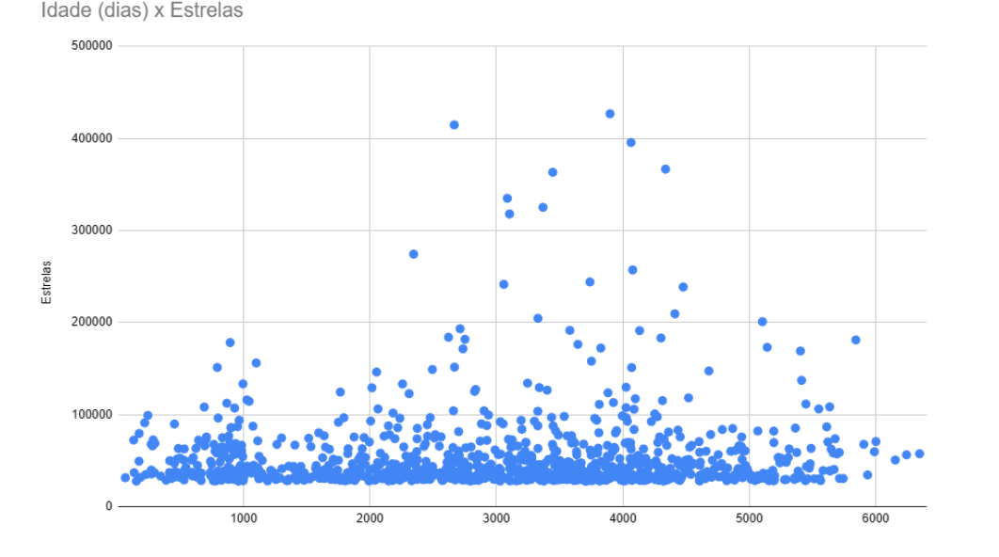
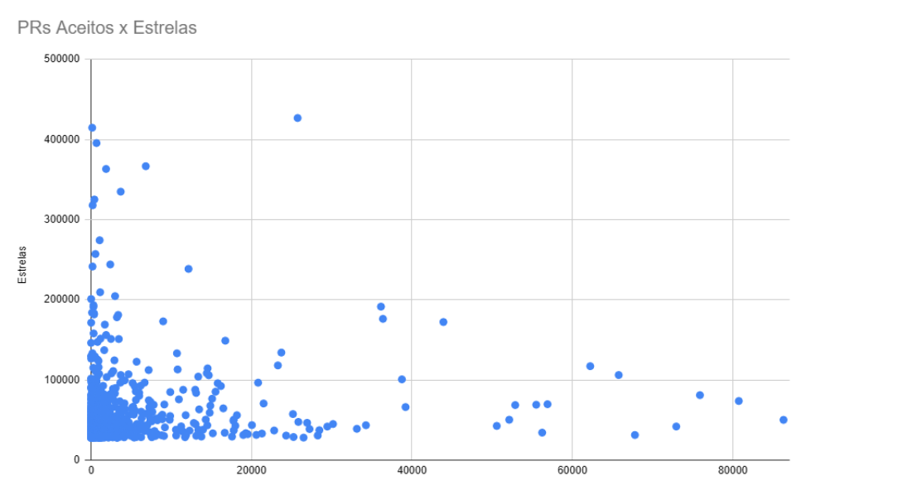
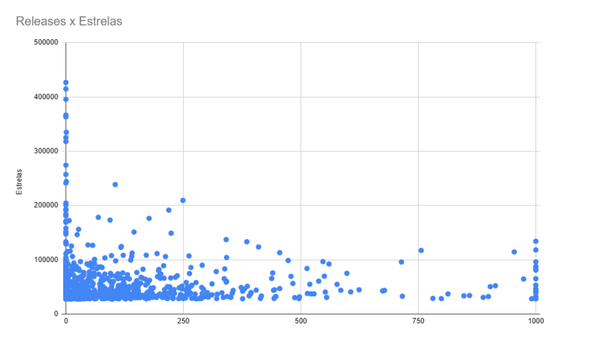
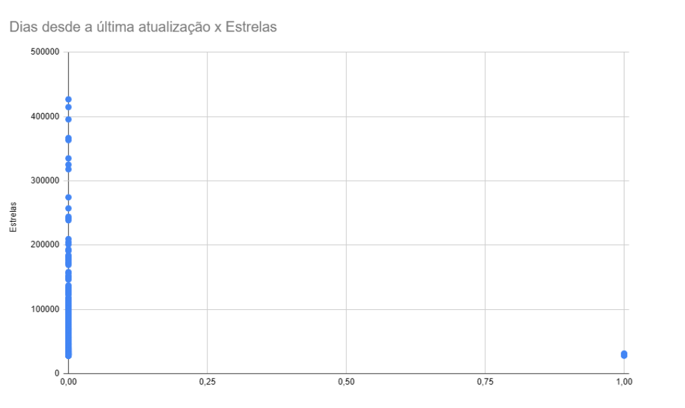
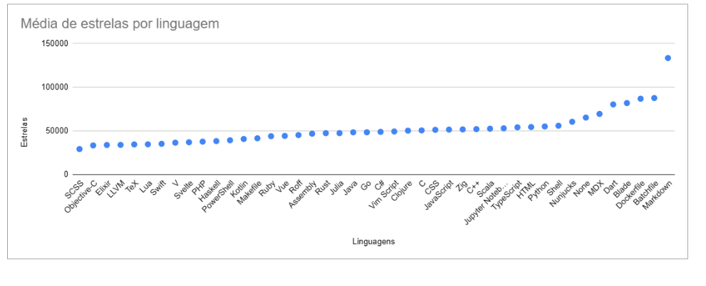
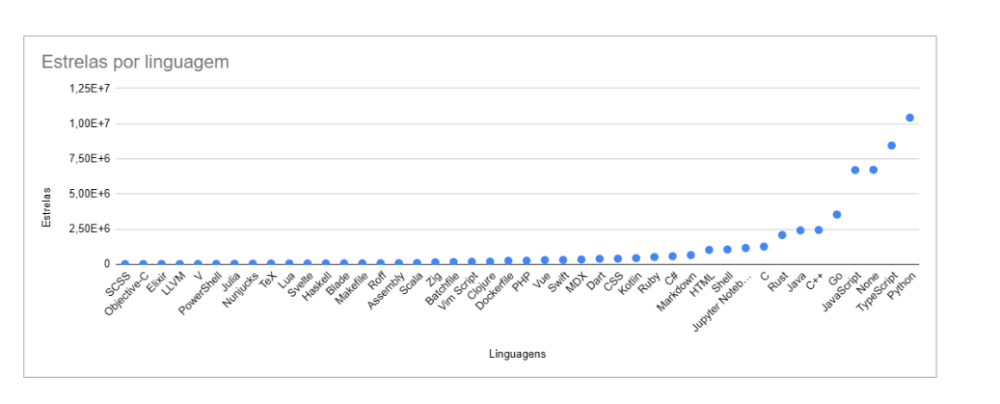
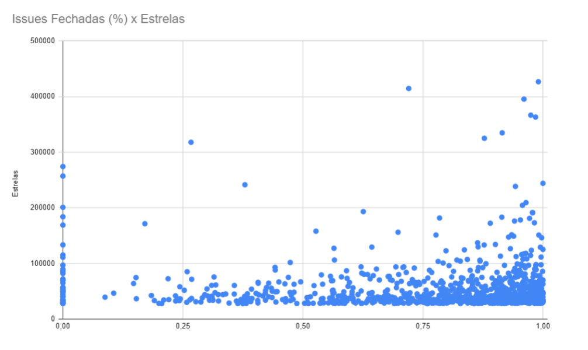

# Análise dos Fatores de Popularidade em Projetos de Código Aberto no GitHub

## Resumo

Este artigo investiga os fatores que influenciam a popularidade de repositórios de código aberto na plataforma GitHub através de uma abordagem baseada em análise de dados. Examinamos seis hipóteses principais relacionadas a características de projetos populares, utilizando como métrica principal o número de estrelas. Nossos resultados mostram que a popularidade é um fenômeno multifatorial, com a linguagem de programação emergindo como o fator mais consistentemente correlacionado, enquanto características como idade do projeto e volume de contribuições mostraram correlações menos significativas.

## Introdução

O ecossistema de código aberto transformou-se em elemento fundamental do desenvolvimento de software moderno, com plataformas como o GitHub facilitando não apenas o armazenamento de código, mas também a colaboração em escala global. A popularidade de um repositório, frequentemente medida pelo número de estrelas, serve como indicador de valor percebido pela comunidade de desenvolvedores. Este estudo busca identificar padrões e características comuns entre repositórios populares através da investigação de seis hipóteses principais.

Nossas hipóteses de pesquisa incluíram:
- A suposição de que sistemas populares seriam mais maduros e antigos (H1)
- Que receberiam muitas contribuições externas na forma de pull requests aceitas (H2)
- Que lançariam releases com frequência (H3)
- Que seriam atualizados constantemente (H4)
- Que estariam escritos em linguagens de programação populares (H5)
- Que manteriam alta taxa de fechamento de issues (H6)

Cada uma dessas hipóteses foi formulada com base na premissa de que projetos bem-sucedidos exibiriam padrões mensuráveis em sua trajetória de desenvolvimento.

## Metodologia

Nossa abordagem metodológica envolveu um processo sistemático de coleta, processamento e análise de dados. Utilizamos a API GraphQL do GitHub para coletar dados dos repositórios mais populares, definindo como critério de popularidade possuir mais de 1000 estrelas. O processo de coleta foi realizado através de scripts Python personalizados que implementaram mecanismos de retry para lidar com falhas de conexão e respeitar os limites de rate limiting da plataforma.

O processo de coleta apresentou desafios técnicos significativos, particularmente as limitações impostas pela API do GitHub que restringiam o número de requisições, necessitando da implementação de pausas estratégicas entre as consultas. Além disso, encontramos problemas com dados incompletos em repositórios antigos e variabilidade na estrutura de dados entre diferentes repositórios, exigindo um processo robusto de limpeza e normalização.

Para cada hipótese, definimos métricas específicas:
- Idade do repositório em dias para H1
- Número de pull requests aceitas para H2
- Quantidade de releases para H3
- Dias desde a última atualização para H4
- Linguagem de programação principal para H5
- Taxa de fechamento de issues para H6

Implementamos técnicas de tratamento de outliers usando o método de Intervalo Interquartil (IQR), removendo valores estatisticamente extremos mas mantendo os repositórios excepcionais que eram objetos de estudo relevantes.

A análise dos dados centrou-se na geração e interpretação de visualizações, utilizando gráficos de dispersão para examinar relações entre métricas e popularidade, e gráficos de barras para análise de distribuição por linguagens. Os gráficos gerados revelaram padrões importantes:

- Para H1, o gráfico de dispersão "Idade x Estrelas" mostrou ausência de correlação clara, com muitos repositórios jovens alcançando alta popularidade.
- Para H2, o gráfico "PRs Aceitas x Estrelas" igualmente não mostrou correlação evidente, indicando que volume de contribuições não determina necessariamente popularidade.
- O gráfico "Releases x Estrelas" (H3) apresentou padrão similar de dispersão.
- O gráfico "Dias desde Última Atualização x Estrelas" (H4) mostrou que a maioria dos repositórios populares se concentrava próximo a zero no eixo X, indicando atualização recente, mas com outliers significativos.
- Para H5, os gráficos de barras mostraram dominância clara de Python, JavaScript e TypeScript.
- Para H6, o gráfico de dispersão mostrou concentração de projetos populares entre 70-100% de fechamento de issues, mas com exceções notáveis.

## Resultados e Discussão

De modo geral, as hipóteses informais levantadas foram desafiadas ou parcialmente 
confirmadas pelos resultados. A popularidade de um projeto de código aberto, conforme 
medida pelo número de estrelas, parece ser um fenômeno mais complexo e multifacetado do 
que a mera correlação com a idade, o volume de contribuições externas ou a frequência de 
releases. Outros fatores, como a relevância do problema que o projeto resolve, a qualidade da 
documentação, a acessibilidade para novos usuários, ou até mesmo tendências de mercado e 
adoção por grandes empresas, podem desempenhar um papel mais significativo na ascensão 
de um projeto ao estrelato. A linguagem de programação utilizada e a taxa de fechamento de 
issues (com algumas ressalvas) mostram-se mais alinhadas com a popularidade, indicando a 
importância da base tecnológica e da gestão do projeto. Esta análise serve como um ponto de 
partida para investigações mais profundas sobre os drivers de popularidade no ecossistema de 
código aberto. 

- **H1 (Idade)**: O gráfico "Idade (dias) x Estrelas" não mostra uma correlação clara. A maioria dos repositórios, 
populares ou não, está concentrada nas idades mais baixas, o que sugere que muitos projetos 
podem alcançar um alto número de estrelas em pouco tempo. Não há uma tendência de que os 
projetos mais antigos sejam, necessariamente, os mais populares.
  

- **H2 (Pull Requests)**: O gráfico "PRs Aceitos x Estrelas" também não apresenta uma correlação evidente. Embora 
haja alguns repositórios com um número muito alto de pull requests aceitas, o número de 
estrelas é bastante disperso, sem uma relação direta com as contribuições externas. Isso 
indica que a popularidade de um projeto não está diretamente ligada à quantidade de 
contribuições aceitas.
  

- **H3 (Releases)**: O gráfico "Releases x Estrelas" mostra que, assim como nos outros casos, não há uma 
correlação forte. Existem projetos com muitas releases e poucas estrelas, e vice-versa. A 
dispersão dos dados indica que o número de releases não é um fator determinante para a 
popularidade de um repositório.
 

- **H4 (Atualizações)**: A análise mostra que a maioria dos sistemas populares apresenta um número reduzido de dias 
desde a última atualização, concentrando-se próximos de zero. Isso indica que projetos 
populares, em sua maioria, são mantidos ativamente. 
Entretanto, observa-se que alguns repositórios continuam muito populares mesmo sem 
atualizações recentes, evidenciando que popularidade pode ser mantida também por fatores 
históricos (como pioneirismo ou utilidade consolidada), independentemente de atualizações 
frequentes.
 

- **H5 (Linguagem)**: A análise mostra que a maioria dos sistemas populares está concentrada em linguagens 
amplamente utilizadas e reconhecidas globalmente, como Python, JavaScript e TypeScript, que 
lideram tanto em número total quanto em média de estrelas por repositório. 
Esse resultado sugere que há uma correlação entre a popularidade das linguagens na 
comunidade de desenvolvedores e a popularidade dos projetos construídos com elas. 
No entanto, observam-se exceções como Markdown e Dockerfile, que, apesar de não 
figurarem entre as linguagens de programação mais comuns, aparecem com elevado número 
de estrelas devido à existência de repositórios de grande impacto que utilizam essas 
linguagens como primárias.

- **H6 (Issues)**: A  análise  mostra  que,  em  geral,  sistemas  populares  apresentam  uma  taxa  elevada  de 
fechamento de issues. O gráfico de dispersão evidencia que os projetos com maior número de 
estrelas concentram-se entre 70% e 100% de fechamento, indicando uma comunidade ativa na 
resolução de problemas.
No  entanto,  também  existem  casos  de  repositórios  bastante  populares  com  taxas  de 
fechamento  muito  baixas, sugerindo que a popularidade não implica, necessariamente, em 
uma gestão eficiente de issues.

## Conclusão

Nossa análise demonstra que a popularidade no GitHub é fenômeno multifatorial influenciado por combinação complexa de fatores técnicos e sociais. Dentre as seis hipóteses testadas, apenas a relação entre linguagem de programação e popularidade mostrou-se consistentemente forte. Os demais fatores investigados mostraram correlações fracas ou context-dependent, sugerindo que popularidade deriva mais de valor percebido e utilidade fundamental que de características processuais específicas.

Estes resultados têm implicações importantes para desenvolvedores e mantenedores de projetos open-source, indicando que investimento em fatores como escolha apropriada de linguagem e qualidade fundamental do projeto pode ser mais impactante que focar exclusivamente em métricas de atividade de desenvolvimento.

## Referências

- BORGES, H.; VALENTE, M. T. What's in a GitHub star? Understanding repository starring practices in a social coding platform. Journal of Systems and Software, 2018.

- KALLIAMVAKOU, E. et al. The promises and perils of mining GitHub. In: Proceedings of the 11th Working Conference on Mining Software Repositories, 2014.

- VASILESCU, B. et al. Quality and productivity outcomes relating to continuous integration in GitHub. In: Proceedings of the 2015 10th Joint Meeting on Foundations of Software Engineering, 2015.

- GITHUB. GraphQL API Documentation. Disponível em: https://docs.github.com/en/graphql

- MCKINNEY, W. Python for Data Analysis: Data Wrangling with Pandas, NumPy, and IPython. O'Reilly Media, 2017.

- HUNTER, J. D. Matplotlib: A 2D graphics environment. Computing in Science & Engineering, 2007.